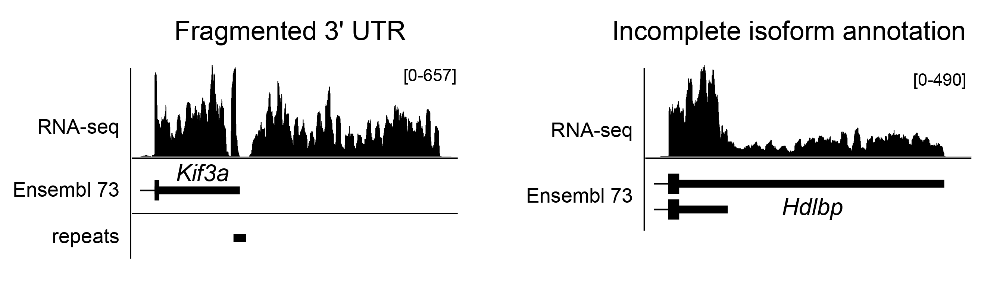
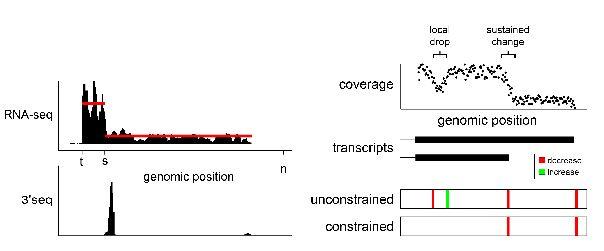
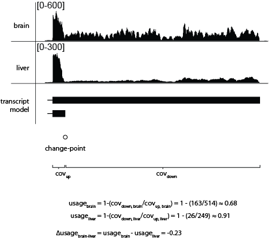

test
====

Major applications of RNA-seq data include studies of how the transcriptome is modulated at the levels of gene expression and RNA processing, and how these events are related to cellular identity, environmental condition, and/or disease status. While many excellent tools have been developed to analyze RNA-seq data, these generally have limited efficacy for annotating 3' UTRs. As illustrated below, existing assembly strategies often fragment long 3' UTRs, and importantly, none of the algorithms in popular use can apportion data into tandem 3' UTR isoforms, which are frequently generated by alternative cleavage and polyadenylation (APA). Consequently, it is often not possible to identify patterns of differential APA using existing assembly tools. 

To address these limitations, we developed Isoform Structural Change Model (IsoSCM),  a new method for transcript assembly that incorporates change-point analysis to improve the 3' UTR annotation process.

usagebrain = 1 - ( covdownstream,brain / covupstream,brain ) &cong; 0.68

usageliver = 1 - ( covdownstream,liver / covupstream,liver ) &cong; 0.91

&Delta;usagebrain-liver = usagebrain-usageliver &cong; -0.23
