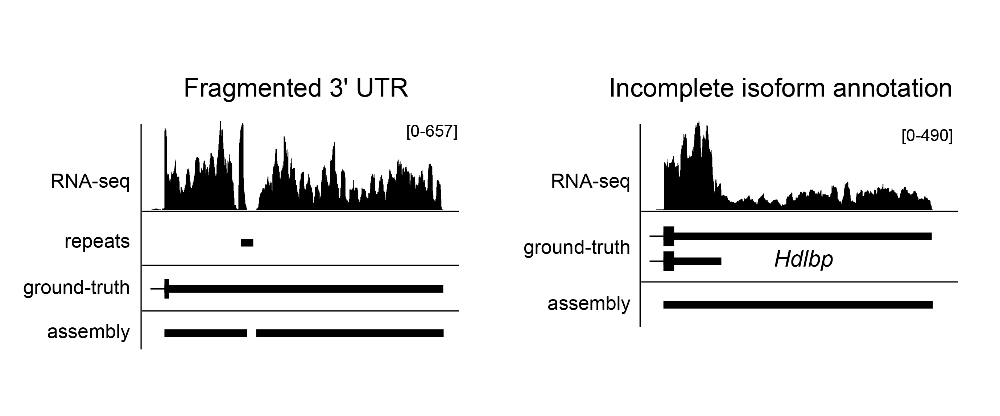
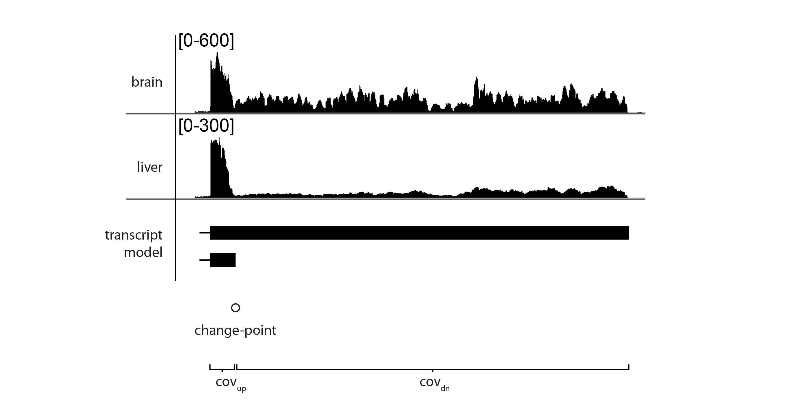

#Overview
====

Major applications of RNA-seq data include studies of how the transcriptome is modulated at the levels of gene expression and RNA processing, and how these events are related to cellular identity, environmental condition, and/or disease status. While many excellent tools have been developed to analyze RNA-seq data, these generally have limited efficacy for annotating 3' UTRs. As illustrated below, existing assembly strategies often fragment long 3' UTRs, and importantly, none of the algorithms in popular use can apportion data into tandem 3' UTR isoforms, which are frequently generated by alternative cleavage and polyadenylation (APA). Consequently, it is often not possible to identify patterns of differential APA using existing assembly tools. 

To address these limitations, we have developed Isoform Structural Change Model (IsoSCM),  a new method for transcript assembly that incorporates change-point analysis to improve the 3' UTR annotation process. If we assume that sequenced reads are distributed approximately uniformly across the transcript, the boundaries of transcription will be marked by a change in the level of coverage. In instances where a shorter exon is nested within a longer exon, there can still be a significant number of reads aligning downstream of the shorter isoform, creating a “step-like” pattern of coverage at the boundary of the nested exon model. To identify terminal exon boundaries, we thus seek critical points (“change-points”) that mark transitions in RNA-seq coverage.

real RNA-seq data contains sequencing biases that can cause the sampling of reads across the transcript body to deviate from a uniform distribution. These biases typically cause short segments of the transcript to be sequenced at a lower frequency than the rest of the transcript, resulting in a local drop in the level of coverage. The conventional (unconstrained) implementation of the change-point detection procedure identifies these local in-homogeneities in coverage as a segment with a distinct coverage distribution. However, in the context of annotating terminal exon boundaries we wish to disregard these local aberrations as they do not correspond to terminal exon boundaries. In order to minimize the effect of local biases on transcript model inference we introduce additional constraints to distinguish localized changes from change-points that mark a sustained decrease in the level of coverage, we restrict the set of identified change-points to conform to a pattern of monotonically decreasing coverage over sequential segments. 

Conveniently, the change-point detection framework used by IsoSCM can also be used to identify differential usage of tandem 3' UTRs among two samples, as illustrated below. 

The resulting joint segmentation can be used to quantitate differential usage of tandem 3'UTR isoforms. For the toy example shown above we can calculate _covup_ and _covdn_, the level of coverage in the segments up and downstream of the identified change-point, and use these quantities to define site usage in each tissue:

usagebrain = 1 - ( covdownstream,brain / covupstream,brain ) &cong; 0.68

usageliver = 1 - ( covdownstream,liver / covupstream,liver ) &cong; 0.91

&Delta;usagebrain-liver = usagebrain-usageliver &cong; -0.23

#Running IsoSCM
